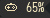

# Dualsense widget for Awesome WM

Displays battery of a connected dualsense controller, and turns off the controller if you middle-click the widget.



## Installation

Clone the repo under "~/.config/awesome/" then add it to your `theme.lua`

```lua
local dualsensebat_widget = require("dualsense.dualsense")

local dualsense = dualsensebat_widget{font=theme.font}
function theme.at_screen_connect(s)
    s.mywibox = awful.wibar({ position = "top", screen = s, height = dpi(22), bg = theme.bg_normal, fg = theme.fg_normal })

    s.mywibox:setup {
            layout = wibox.layout.align.horizontal,
            dualsense
            }
end
```

## Dependencies

This widget depends on [dualsensectl](https://github.com/nowrep/dualsensectl).